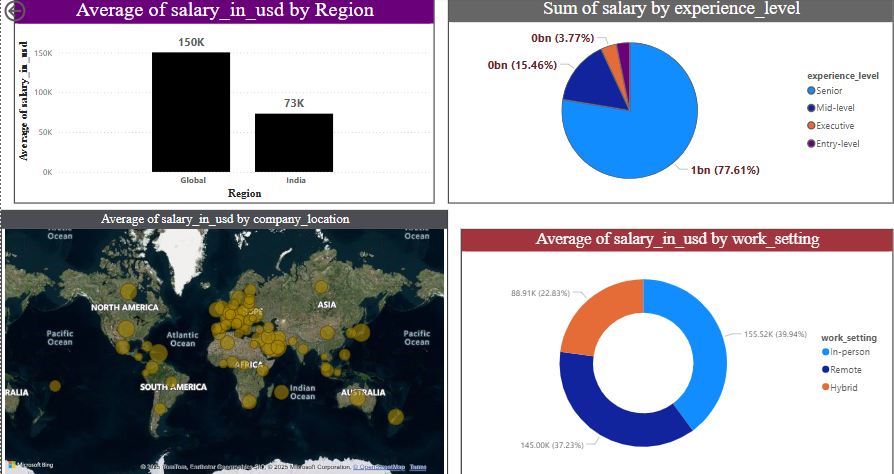

# 💼 Data Science Job Salaries Analysis – SQL + Power BI Dashboard

This project analyzes data science job salaries using **SQL** for data analysis and **Power BI** for visualization. It covers salary trends by role, region, experience level, company size, and work setting (remote/on-site).

---

## 📊 Dashboard Previews

### 🔹 Page 1 – Global vs India Salary Breakdown


### 🔹 Page 2 – Salary Insights by Role & Company Size


---

## 📈 Key Insights

- 🌍 **Global roles** pay nearly 2x more than Indian roles
- 👩‍💼 **Senior-level roles** account for 77% of total salary distribution
- 🏠 **Remote jobs** have the highest average salary (~155K USD)
- 🏢 **Large companies** consistently offer higher pay
- 🧪 Top-paying roles in India include:
  - AI Scientist
  - Principal ML Engineer
  - BI Data Analyst

---

## 📁 Project Files

```
Data-Science-Job-Salaries-Analysis/
├── job_salaries_analysis.pbix       # Power BI dashboard
├── data_cleaning.sql                # SQL script for analysis (optional)
├── dashboard_1.png                  # Screenshot of Page 1
├── dashboard_2.png                  # Screenshot of Page 2
└── README.md                        # Project summary and insights
```

---

## 🧰 Tools Used

- **SQL** – For querying and preparing the dataset
- **Power BI** – For building interactive dashboards
- **Dataset** – Public dataset on global Data Science job salaries (from Kaggle or similar)

---

## 📬 Connect with Me

- 🔗 [LinkedIn – Ramya Hanumantharaju](https://linkedin.com/in/ramya-hanumantharaju)
- 💌 Email: ramyahanumantharaju@gmail.com

---

⭐ Star this project if you found it helpful!
